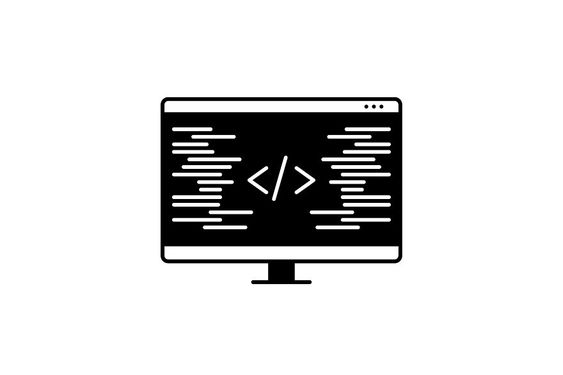

# Проекты Фронтенда

Этот репозиторий содержит различные проекты веб-разработки, демонстрируя мою работу в области фронтенд-разработки. Я регулярно обновляю этот репозиторий новыми проектами, чтобы продемонстрировать мои навыки и прогресс.

## Описание

Здесь вы найдете коллекцию проектов, охватывающих различные аспекты веб-разработки, включая HTML, CSS, JavaScript и многое другое. Каждый проект разработан для выделения конкретных навыков и техник в области фронтенд-разработки.

Не стесняйтесь изучать проекты и предоставлять обратную связь. Ваши предложения и комментарии всегда приветствуются!
